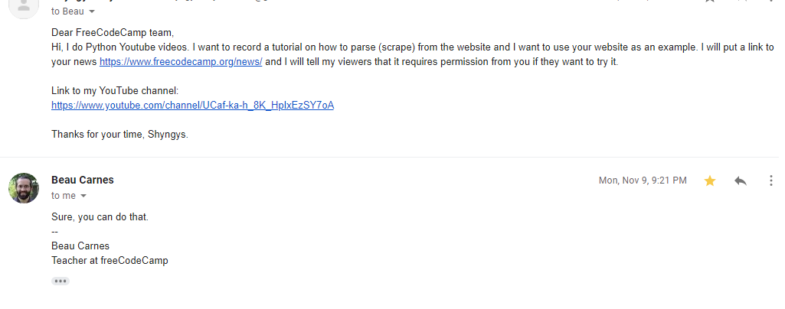
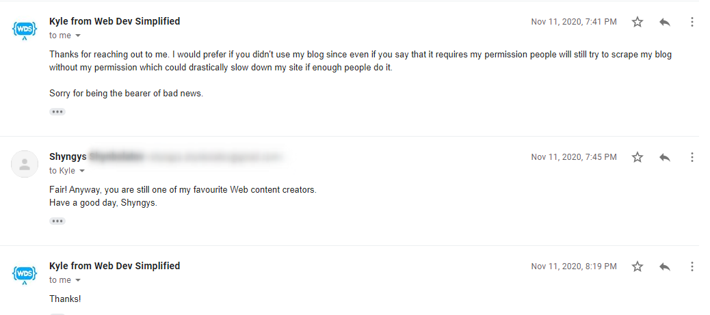

# About deno-fetch
Fetching https://www.freecodecamp.org/news/ using Deno.

# Notice: 
We have a written permission from the owner, Beau Carnes, to scrape his website.

### Why you should get a permission?
Fetching somebody's website could drastically slow down his site if enough people do it.
Not everyone gives permission(s). For example, Kyle from <a href="https://www.youtube.com/channel/UCFbNIlppjAuEX4znoulh0Cw">WebDevSimplified (YouTube channel)</a>
